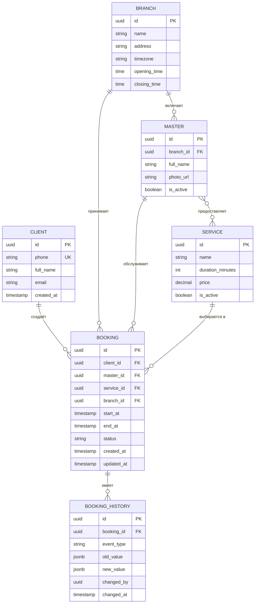
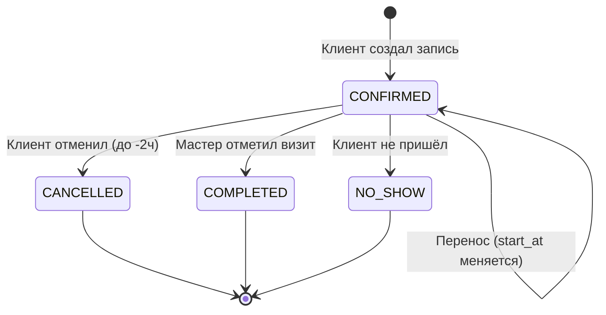

# 3. Модель данных

## 3.1. ER-диаграмма

Использована нотация **Crow's Foot** (диаграмма рендерится в GitHub через Mermaid).

## 3.2. Описание сущностей

### CLIENT — клиент
Пользователь, записывающийся на услугу.

| Поле | Тип | Обязательное | Описание |
|---|---|---|---|
| `id` | UUID | ✓ | Уникальный идентификатор клиента (PK) |
| `phone` | VARCHAR(20) | ✓ | Номер телефона в формате E.164, уникальный |
| `full_name` | VARCHAR(150) | ✓ | ФИО клиента |
| `email` | VARCHAR(254) | — | Email (опционально) |
| `created_at` | TIMESTAMP | ✓ | Дата регистрации в UTC |

**Индексы:** уникальный индекс по `phone`.

---

### BRANCH — филиал
Физическое расположение барбершопа.

| Поле | Тип | Обязательное | Описание |
|---|---|---|---|
| `id` | UUID | ✓ | PK |
| `name` | VARCHAR(100) | ✓ | Название филиала («BarberBook на Абая») |
| `address` | VARCHAR(255) | ✓ | Полный адрес |
| `timezone` | VARCHAR(50) | ✓ | IANA timezone, например `Asia/Almaty` |
| `opening_time` | TIME | ✓ | Время открытия (локальное) |
| `closing_time` | TIME | ✓ | Время закрытия (локальное) |

---

### MASTER — мастер
Сотрудник, оказывающий услуги.

| Поле | Тип | Обязательное | Описание |
|---|---|---|---|
| `id` | UUID | ✓ | PK |
| `branch_id` | UUID | ✓ | FK → `BRANCH.id` |
| `full_name` | VARCHAR(150) | ✓ | ФИО мастера |
| `photo_url` | VARCHAR(500) | — | Ссылка на аватар |
| `is_active` | BOOLEAN | ✓ | Работает ли сейчас (для мягкого удаления) |

**Индексы:** `(branch_id, is_active)`.

---

### SERVICE — услуга
Справочник услуг (стрижка, борода и т.д.).

| Поле | Тип | Обязательное | Описание |
|---|---|---|---|
| `id` | UUID | ✓ | PK |
| `name` | VARCHAR(100) | ✓ | Название («Мужская стрижка») |
| `duration_minutes` | INT | ✓ | Длительность в минутах, должна быть кратна 15 |
| `price` | DECIMAL(10,2) | ✓ | Цена в тенге |
| `is_active` | BOOLEAN | ✓ | Флаг активности |

---

### BOOKING — запись (центральная сущность)
Забронированный слот клиентом.

| Поле | Тип | Обязательное | Описание |
|---|---|---|---|
| `id` | UUID | ✓ | PK |
| `client_id` | UUID | ✓ | FK → `CLIENT.id` |
| `master_id` | UUID | ✓ | FK → `MASTER.id` |
| `service_id` | UUID | ✓ | FK → `SERVICE.id` |
| `branch_id` | UUID | ✓ | FK → `BRANCH.id` (денорм. для быстрой фильтрации) |
| `start_at` | TIMESTAMP (UTC) | ✓ | Дата/время начала визита |
| `end_at` | TIMESTAMP (UTC) | ✓ | Дата/время окончания (= start_at + service.duration) |
| `status` | VARCHAR(20) | ✓ | Enum: см. ниже |
| `created_at` | TIMESTAMP | ✓ | Когда создана |
| `updated_at` | TIMESTAMP | ✓ | Когда последний раз изменялась |

**Возможные значения `status`:**

| Статус | Описание | Переходы |
|---|---|---|
| `CONFIRMED` | Запись активна, ожидается визит | → `CANCELLED`, `COMPLETED`, `NO_SHOW` |
| `CANCELLED` | Отменена клиентом или админом | (финальный) |
| `COMPLETED` | Визит состоялся | (финальный) |
| `NO_SHOW` | Клиент не пришёл | (финальный) |

**Индексы:**
- `(master_id, start_at)` — для быстрого поиска слотов мастера.
- `(client_id, status)` — для раздела «Мои записи».
- Уникальный частичный индекс: `(master_id, start_at) WHERE status = 'CONFIRMED'` — защита от двойного бронирования на уровне БД.

**Бизнес-инварианты (проверяются на уровне приложения):**
- `end_at > start_at`
- `start_at >= NOW()` при создании.
- Новая запись не пересекается по времени с существующими `CONFIRMED` записями того же мастера.

---

### BOOKING_HISTORY — история изменений записи
Аудит-лог всех изменений (перенос, отмена, смена статуса).

| Поле | Тип | Обязательное | Описание |
|---|---|---|---|
| `id` | UUID | ✓ | PK |
| `booking_id` | UUID | ✓ | FK → `BOOKING.id` |
| `event_type` | VARCHAR(30) | ✓ | Тип события: `CREATED`, `RESCHEDULED`, `CANCELLED`, `STATUS_CHANGED` |
| `old_value` | JSONB | — | Значение до изменения |
| `new_value` | JSONB | — | Значение после изменения |
| `changed_by` | UUID | ✓ | ID того, кто сделал изменение (client_id или admin_id) |
| `changed_at` | TIMESTAMP | ✓ | Timestamp события |

**Зачем нужна отдельная таблица:** для аналитики (сколько переносов, сколько отмен), разборов спорных ситуаций и требований аудита.

---

### MASTER_SERVICE (связь many-to-many)
Какие услуги оказывает каждый мастер.

| Поле | Тип | Описание |
|---|---|---|
| `master_id` | UUID | FK → `MASTER.id` |
| `service_id` | UUID | FK → `SERVICE.id` |

**PK:** составной (`master_id`, `service_id`).

## 3.3. Диаграмма состояний записи

Жизненный цикл записи:

