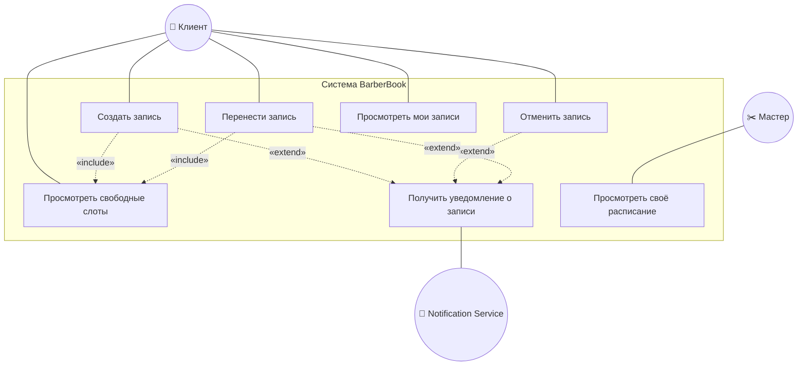
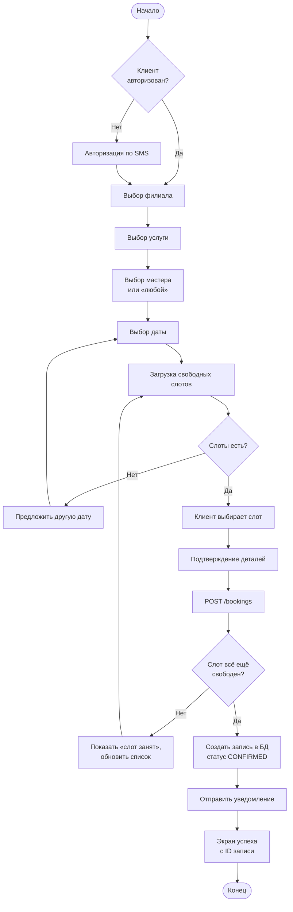
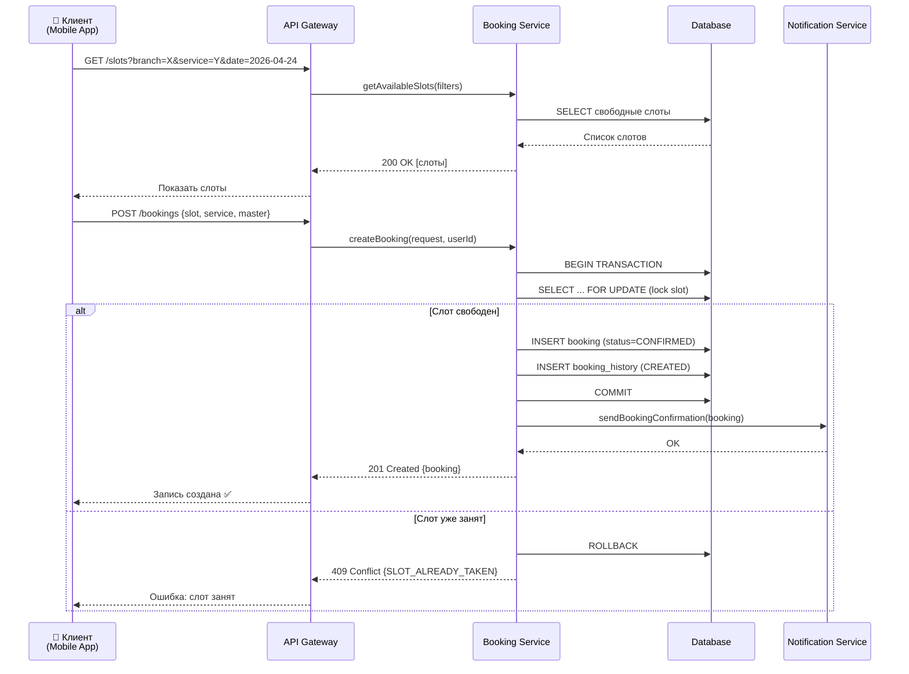
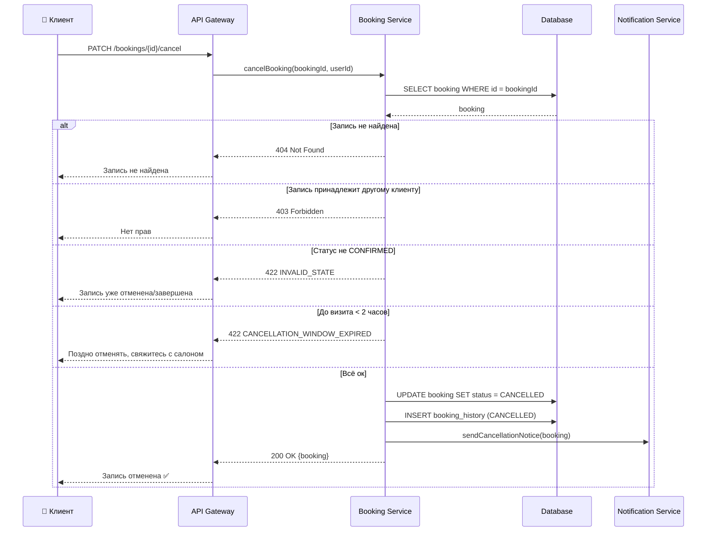
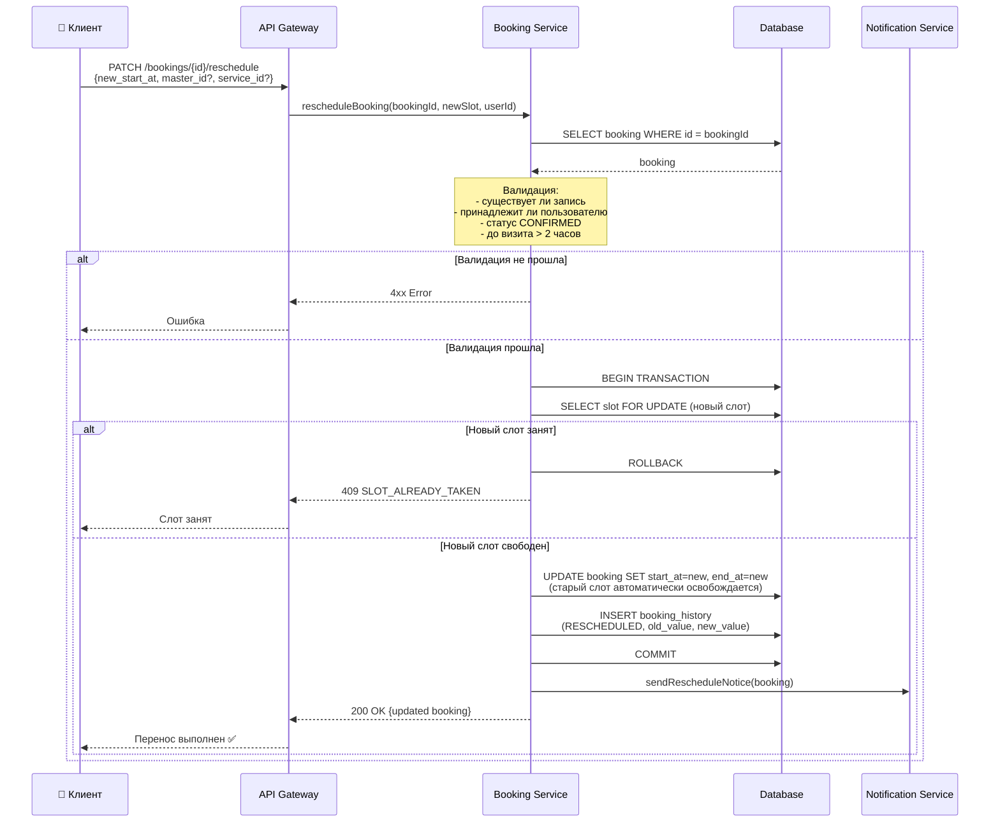
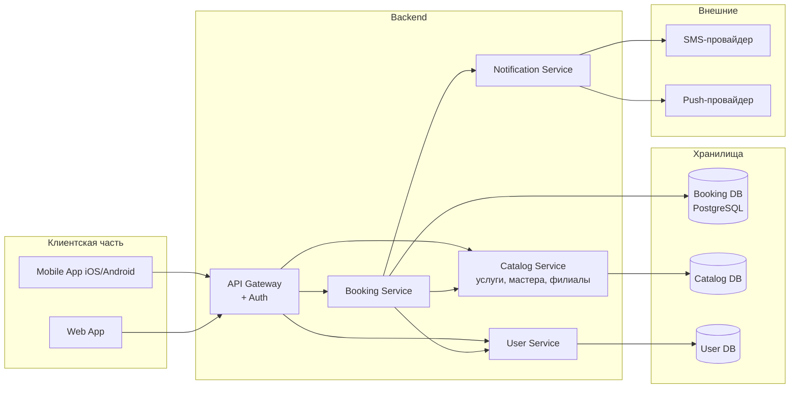

# 4. UML-диаграммы

Все диаграммы выполнены в нотации **UML 2.x** и реализованы через **Mermaid**, который рендерится в GitHub, GitLab, Notion и большинстве современных инструментов.

---

## 4.1. Use Case Diagram — диаграмма вариантов использования

Показывает, кто и что может делать в системе (скоуп клиентской части).

**Пояснения:**
- **Actor «Клиент»** — первичный актор, все основные сценарии.
- **Actor «Мастер»** — показан для контекста; его функциональность вне скоупа данного ТЗ.
- **Actor «Notification Service»** — внешняя система (SMS/push), вторичный актор.
- **«include»** означает обязательную часть сценария (чтобы создать запись — нужно сначала увидеть слоты).
- **«extend»** означает расширение (уведомление отправляется, но это отдельный шаг).

---

## 4.2. Activity Diagram — процесс бронирования

Показывает пошаговый флоу пользователя при создании записи.

---

## 4.3. Sequence Diagram — создание записи

Показывает взаимодействие компонентов во времени при успешном создании записи.

**Ключевые моменты:**
- Блокировка строки через `SELECT ... FOR UPDATE` защищает от гонки (race condition) при одновременной записи двух клиентов.
- Уведомление отправляется **после** коммита транзакции, чтобы не отправить подтверждение по неудачной записи.

---

## 4.4. Sequence Diagram — отмена записи

---

## 4.5. Sequence Diagram — перенос записи

Самый сложный сценарий: нужно атомарно освободить старый слот и занять новый.

**Почему ID записи не меняется при переносе:**
Это упрощает аналитику и клиентскую часть: запись «живёт» как один объект от создания до завершения/отмены. Вся история переносов — в `BOOKING_HISTORY`.

---

## 4.6. Component Diagram — упрощённая архитектура

Контекстная диаграмма: как Booking Service встраивается в общую систему.

**Скоуп этого ТЗ:** тёмно-синий блок **Booking Service** и его интеграции с соседями.
